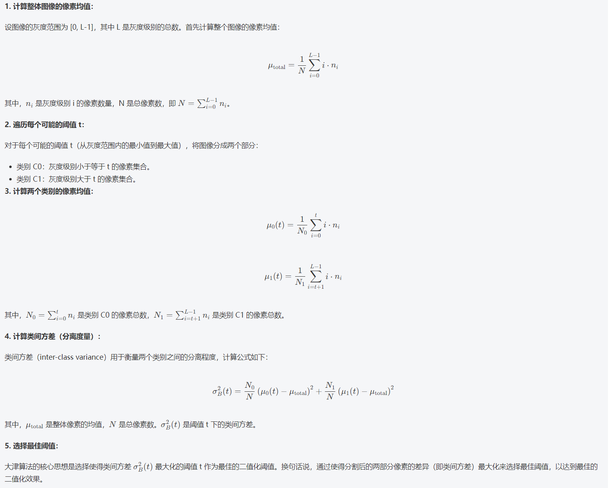
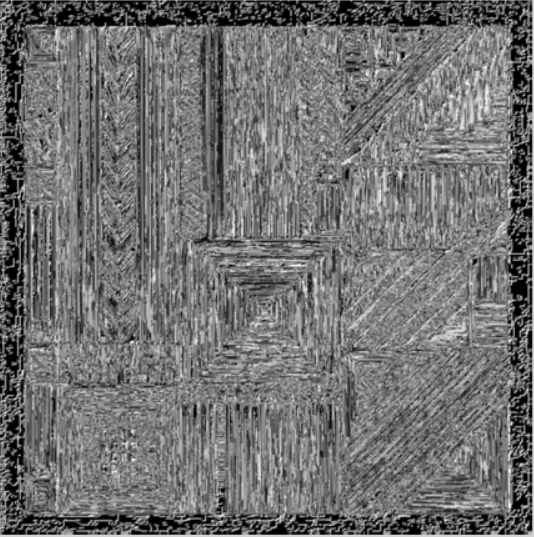
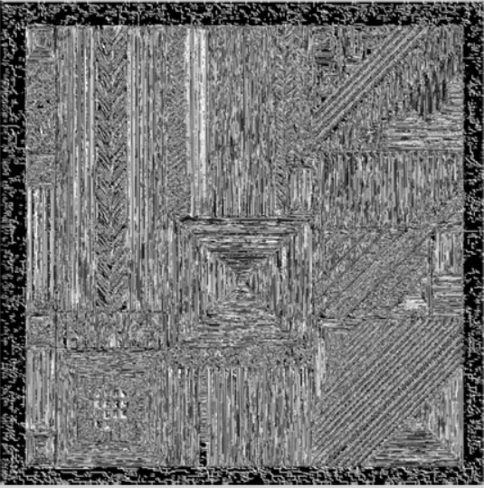
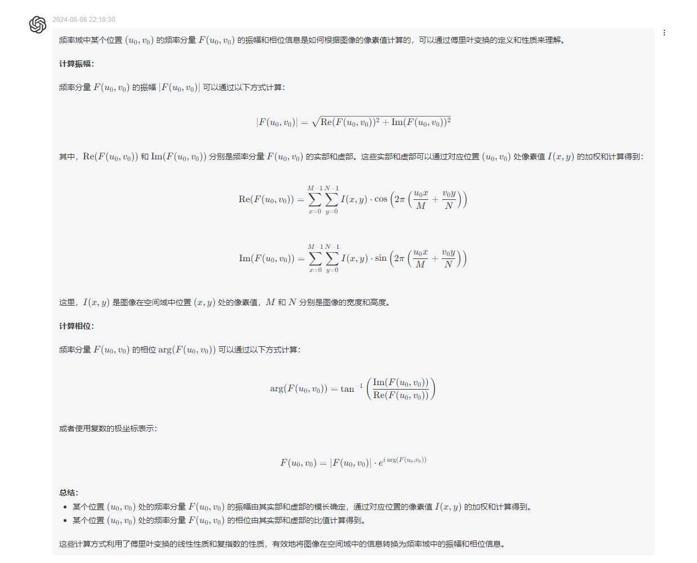
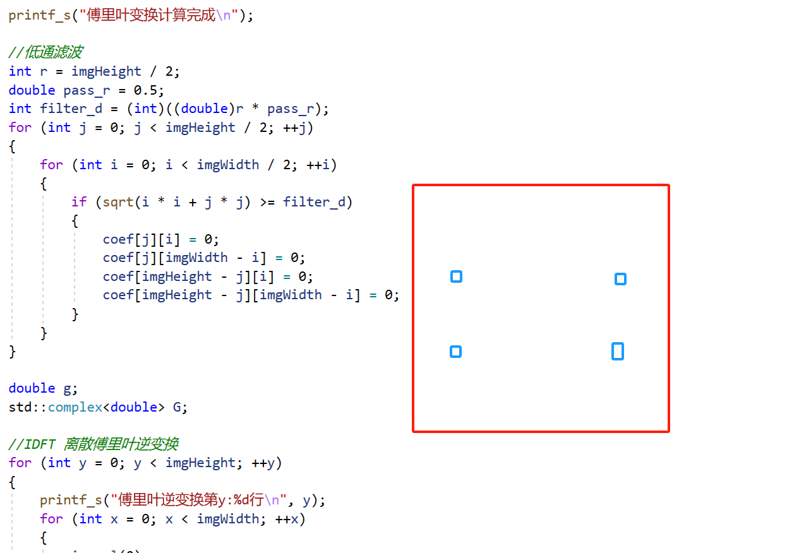

# Opencv的100道题目
## 1-10题的题目：
### 1-20需要引入头文件：A_1_10.h
- [通道交换](/A1.cpp "通道交换")

- [灰度化](/A2.cpp "灰度化")
- [二值化](/A3.cpp "二值化")
- [大津二值化算法](/A4.cpp "大津二值化算法")
- [RGB->HSV色域变换](/A5.cpp "RGB->HSV色域变换")
- [减色处理](/A6.cpp "减色处理")
- [平均池化](/A7.cpp "平均池化")
- [最大池化](/A8.cpp "最大池化")
- [高斯滤波](/A9.cpp "高斯滤波")
- [中值滤波](/A10.cpp "中值滤波")

## 1-10题重要算法解析：
### 一维高斯分布


### 二维高斯分布


### 大津二值化算法--最大类内方差


> 大津二值化算法的要点：
>
> 1. 大津二值化算法的算法假设：图像灰度分布呈现双峰性，同时类间方差与图像分割的质量具有较大相关性；
>    1. 大津算法假设，如果能够找到一个阈值 t，使得分割后的两个类别（C0 和 C1）的类间方差  \sigma_B^2(t) *σ**B*2(*t*) 达到最大值，那么这个阈值 t 将能够最有效地将图像分成两部分，使得前景和背景之间的差异最大化；
>    2. 存在两个明显的峰值，一个代表前景（目标），另一个代表背景；
> 2. 在图像灰度分布呈现双峰时，为什么类间方差最大能够很好地分割图像呢？
>    1. 如果图像灰度呈现双峰，那么前景和背景的平均灰度值之间的差异较为明显，而从数学上，方差表达的是数据集中每个样本点与其均值之间的差异程度；而大津二值化算法中如果A类像素的平均灰度值与图像整体平均灰度值的差异程度，和 B类像素的平均灰度值与图像整体平均灰度值的差异程度的加和，最大，就此时的分割值能带来最好的分割效果。
> 3. 


### HSV色调翻转

> **HSV色调翻转：**
>
> 1. HSV图像的色调翻转是指将色调通道H，进行反转；其取值为0~180；因此翻转：180-H也是可以的；
> 2. fmod函数用于计算两个浮点数的余数；fmod(imgHSV.at<Vec3f>(y, x)[0] + 180, 360);
>
> **RGB图像转换为HSV图像：**
>
> 1. 该转换过程遵循固定的数据公式和计算流程：RGB通道归一化、先计算亮度V，再计算饱和度S，然后计算色调H；
>
> **HSV图像转换为RGB图像：**
>
> 1. 根据饱和度和亮度计算颜色的强度C、根据色调H将色彩图360度分成六个部分，每一部分对应一个RGB颜色的分量变化、根据色调分区，计算RGB分量的值；


### **减色处理**

> 1. 设定一个减色因子；原始数据遵循一个公式变换成新数据：原始像素 / n * n + n / 2; 


### 平均池化

> 1. 平均池化是将一张图像平均切分为N份网格；
> 1. 池化范围即卷积核尺寸，步长默认是与池化范围保持一致；但是也可以不一致；
> 1. 事实上，在很多经典的模型中，池化层的步长和池化范围是不一致的，这样一是为了降低空间分辨率，二是获取到更大空间区域的特征信息；


### 高斯滤波

> 1. 卷积操作，在工程实现上，卷积核是通过一行向量存在的，而卷积操作，相同读取顺序（先行后列还是先列后行）的卷积核和原始图像的卷积区域，进行乘积和相加；


## 11-10题的题目：
- [均值滤波器](/A11.cpp "均值滤波器")

> 1. 区别于池化层，它的步长是1；
> 2. 先定位到某个像素，根据卷积核的size计算对应区域的像素与卷积核的加权和。

- [Motion Filter](/A12.cpp "Motion Filter")

> 1. 与均值滤波器不同的是，后者的卷积核设计不同；
> 2. 卷积操作最需要注意的是边界的控制；
> 3. 卷积核所有权重的加和是需要等于1的；

- [MAX-MIN滤波器](/A13.cpp "MAX-MIN滤波器")

> 1. 虽然不是一个滤波核，但是**更为本质的是，卷积核代表了一种当前区域像素的计算规则**。

- [差分滤波器](/A14.cpp "差分滤波器")

> 1. 卷积核，在当前的工程环境下，似乎二维数组也是很合理的；
> 2. 差分滤波器，用于**检测覆盖区域内像素值的变化程度**；
> 3. 以水平差分滤波器为例，在当前工程实现中-1，1，0，这种搭配，配合uchar的数据范围（0~255），只能展现低像素向高像素的变化；而高像素向低像素的变化会呈现0；

- [Sobel滤波器](/A15.cpp "Sobel滤波器")

>1. 水平卷积核：不仅仅是2向-2的变化；而且还有
>
>2. ❓ 2与-2的卷积核 与 -2与2的卷积核的效果差别如何？—— 效果上还真有差别，但是具体的差别不太懂(从图像上看是黑白的差别)
>
>    
>
>   

- [Prewitt滤波器](/A16.cpp "Prewitt滤波器")

> 1. 两个卷积核
>
>    ```
>    	double kPrewittHorizontal[kSize][kSize] = { {-1, 0, 1}, {-1, 0, 1}, {-1, 0, 1} };
>    	double kPrewittVertical[kSize][kSize] = { {-1, -1, -1}, {0, 0, 0}, {1, 1, 1} };
>    ```
>
> 2. 目前来看，综合soble和当前核，一般左边或者上边的权重都是负值；

- [Laplacian滤波器](/A17.cpp "Laplacian滤波器")

> 1. double kLaplacian[kSize][kSize] = { {0, 1, 0}, {1, -4, 1}, {0, 1, 0} }; // 特殊的设计；

- [Emboss滤波器](/A18.cpp "Emboss滤波器")

> 1. double kEmboss[kSize][kSize] = { {-2, -1, 0}, {-1, 1, 1}, {0, 1, 2} };
> 2. 模仿光照方向，呈现立体感和浮雕的感觉；

- [LoG滤波器](/A19.cpp "LoG滤波器")

> 1. LoG滤波器是一种结合了高斯平滑和拉普拉斯操作的滤波器，用于检测图像中的边缘和斑点（blob）。

- [直方图(C++)](/A20.cpp "直方图")
- [直方图(python)](/A20.py "直方图")

### 11-20需要引入头文件：A_11_20.h
11-20题全是关于滤波器的题目

### 什么是边缘？
边缘一般是指图像中某一局部强度剧烈变化的区域。强度变化一般有2中情况，阶跃效应和屋顶效应。而边缘检测的任务就是找到具有阶跃变化或者屋顶变化的像素点的集合。
边缘检测基本原理：
- 对于阶跃效应：一阶微分的峰值为边缘点，二阶微分的零点为边缘点。
具体来说，从阶跃效应的那张图可以看到边缘处的斜率（一阶导）最大，所以一阶微分的峰值是边缘点，而斜率是先增大后减小的，即边缘点的二阶导为0处。
#### 阶跃效应


- 对于屋顶效应：一阶微分的零点为边缘点，二阶微分的峰值为边缘点。
#### 屋顶效应


## 11-20题重要算法解析：
### 均值滤波器

### 运动滤波器

### MAX-MIN滤波器(效果图)

### 差分滤波器


### Sobel滤波器

### Prewitt滤波器

### Laplacian滤波器

### Emboss滤波器

### LoG滤波器

### 直方图


## 21-30题的题目：
### 11-20需要引入头文件：A_21_30.h
- [直方图归一化](/A21.cpp "直方图归一化")

> 1. 当前的工程实现中，归一化是在调整图像像素的取值范围，从非0非255的区间调整到0~255的区间。最为关键的操作是：imgOut.at<Vec3b>(y, x)[c] = (uchar)((newEnd-newStart)/(end-start)*(val-start)+newStart);

- [方图操作](/A22.cpp "方图操作")

> 1. 具体的操作目的不清楚。应该是希望调整图像的正态分布；

- [直方图均衡化](/A23.cpp "直方图均衡化")

> 1. double hist[255];` 这里声明了一个长度为255的数组，但实际上应该是256，因为灰度级范围是从0到255，共256个可能的值。

- [伽玛校正](/A24.cpp "伽玛校正")

> 1. 图像的像素矫正，是通过统计图像整体或者局部的信息，来调整每个位置的像素值。
> 2. 伽马矫正的时候，是基于0~1区间的像素值进行的；

- [最邻近插值](/A25.cpp "最邻近插值")

> 1. 工程实现中，输出图像每个位置的像素，也都是与输入图像每个位置的像素是一一对应的；
> 2. 原理：当图像需要放大或者缩小时，会按照缩放比例找到离目标位置最近的已知像素，并将值赋值给目标位置；该思路在工程实现上是通过static_cast<int>截断的方式控制的；

- [双线性插值](/A26.cpp "双线性插值")

> 1. 双线性插值，某一个位置的像素是基于从其当前位置（的floor+int形式）开始的斜向下的四个点的坐标，以及其他三个点到起始点的距离的倒数作为权重，进行加权和得到的。
> 2. 相比于最邻近插值，它考虑了更多相邻点的像素且权重计算方式比较合理，因而它的平滑性更好；

- [双三次插值](/A27.cpp "双三次插值")

> 1. 它考虑了更多的相邻点，16个；其平滑性更好，细节保持能力更高，对应地，它的计算复杂度比较高；
> 2. 权重计算同样基于目标位置与相邻点之间距离的倒数；
> 3. 旋转的时候，可以考虑使用双三次插值，能获得更好的效果；
> 4. 16个相邻点，同样是基于目标位置的floor+int形式，进行寻找；
> 5. **这里使用到了三次插值函数❓**

- [仿射变换-平行移动](/A28.cpp "仿射变换-平行移动")

> 1. **单个像素级别的平行移动与放缩，依赖于公式，但是理解公式才是重点；**

- [仿射变换-放大缩小](/A29.cpp "仿射变换-放大缩小")
- [仿射变换-旋转](/A30.cpp "仿射变换-旋转")

## 21-30题重要算法解析：
### 均值方差均方差

### 伽马矫正

### 最邻近插值

### 双线性插值


### BiCubic函数

### 双三次插值


### 齐次坐标系到笛卡尔坐标系转换

### 放射变换


#### 平移量为0的仿射变换
  
  

## 31-40题的题目：
### 31-40需要引入头文件：A_31_40.h
- [仿射变换（Afine Transformations）——倾斜](/A31.cpp "仿射变换（Afine Transformations）——倾斜")

> 

- [傅立叶变换](/A32.cpp "傅立叶变换")

>1. 傅里叶变换中，低频表示图像中变化比较缓慢的区域，而高频表示图像中变化比较剧烈的区域；

- [傅立叶变换——低通滤波](/A33.cpp "傅立叶变换——低通滤波")
- [傅立叶变换——高通滤波](/A34.cpp "傅立叶变换——高通滤波")
- [35 傅立叶变换——带通滤波](/A35.cpp "傅立叶变换——带通滤波")

> 1. **傅里叶表述中，最为神奇的一点是：某个位置的频率分量（的幅度）表示了图像在不同频率下的贡献；它强调的是图像在某个频率下的贡献度，是一种贡献，而且主体是图像，而不是对应位置的单个像素**。
>
> 2. *F*(*u*,*v*)=*A*(*u*,*v*)+*j**B*(*u*,*v*) 其中A表示实部，B表示虚部；
>
> 3. **某个位置的频率分量的振幅和相位信息是如何根据对应位置的像素值和整个图像的像素计算的呢**
>
>    **<u>某一位置的像素值、坐标和整张图像的像素和位置信息 --> 计算频率分量的实部和虚部 --> 计算振幅和相位；</u>** 🎯
>
>    
>
> 4. 低通滤波的实现方式：**对称性的过滤过程！**
>
>    

- [36 霍夫变换：直线检测-霍夫逆变换](/A36.cpp "霍夫变换：直线检测-霍夫逆变换")

> 

- [37 离散余弦变换](/A37.cpp "离散余弦变换")

> 1. 它将一组离散的数据序列转换为一组离散的余弦系数，特点是，将数据转换成分解在不同频率成分上的能量。**它类似于傅里叶变化，因此转换得到的一组离散余弦系数，表示立刻原始数据在不同频率上的贡献**，它更适合于实数信号和有限长度的数据。

- [38 离散余弦变换+量化](/A38.cpp "离散余弦变换+量化")

>1. 量化，对离散余弦系数进行近似表示，通过舍入或者**映射到更小的范围（量化的本质）**来减少数据量。
>2. JPEG压缩中使用的是离散余弦变换，而不是傅里叶变换。原因在于：1. **实用性：它生成的是实数系数，而不是复数系数**；2. 计算效率较高；3. 能量集中性，DCT能将大部分图像的能量集中在较少的低频成分上，这与人类视觉系统的特征相符：即更倾向于关注图像的整体结构和主要特性，即图像中变化缓慢的部分。”**在JPEG压缩中，由于人眼对低频信息更为敏感，DCT能够将图像的大部分能量集中在低频成分上。这样做可以保留图像的主要结构和整体特征，同时通过量化和丢弃高频成分来实现有效的数据压缩，而这种处理方式在视觉上对图像的影响相对较小。**“

- [39 YCbCr 色彩空间](/A39.cpp "YCbCr 色彩空间")

> 1. YCbCr 色彩空间,对于视频编码和图像压缩标准十分重要。
> 2. 亮度Y；色度CbCr。这种分离使得在处理图像时能够更加有效地处理亮度和色度信息，**因为它们通常具有不同的空间频率特性**。
> 3. 人眼对亮度（Y）信息更为敏感，而对色度（CbCr）信息的感知较低。因此，在图像和视频压缩中，可以更多地保留Y分量的精度，而对Cb和Cr分量进行更高程度的压缩，以减少数据量而对图像质量影响较小。
> 4. YCbCr允许不同的色度抽样方式，如4:4:4、4:2:2和4:2:0。这些抽样方式决定了每个Y分量采样点相对于Cb和Cr分量的数量，影响了图像或视频的色彩保真度和压缩效率。
> 5. 在图像和视频压缩标准中，如JPEG和MPEG，YCbCr色彩空间的使用能够显著提高压缩效率。因为在这些标准中，通常会对Cb和Cr分量进行更强的压缩，而Y分量则保留相对较高的精度，从而实现更高的压缩比而保持可接受的视觉质量。
> 6. **总的来说，图像转换到YCbCr空间，基于三个分量对于人类感知的感知差异 --> 可以通过调整三个分量的比例，以及对三个分量不同的量化程度/压缩程度 --> 实现整体更高质量的压缩比。**

- [40 YCbCr+离散余弦变换+量化](/A40.cpp "YCbCr+离散余弦变换+量化")

## 31-40题重要算法解析：
### 傅里叶级数


### 欧拉公式

### 傅里叶变换


### 二维离散余弦变换

### 均方误差

### 均方误差

### YCbCr色彩空间


## 41-50题的题目：
### 41-50需要引入头文件：A_41_50.h
- [Canny边缘检测：边缘强度](/A41.cpp "Canny边缘检测：边缘强度")
- [Canny边缘检测：边缘细化](/A42.cpp "Canny边缘检测：边缘细化")
- [Canny 边缘检测：滞后阈值](/A43.cpp "Canny 边缘检测：滞后阈值")
- [44 霍夫变换：直线检测](/A44.cpp "霍夫变换：直线检测")
- [霍夫变换：直线检测-NMS](/A45.cpp "霍夫变换：直线检测-NMS")
- [霍夫变换：直线检测-霍夫逆变换](/A46.cpp "霍夫变换：直线检测-霍夫逆变换")
- [膨胀（Dilate）](/A47.cpp "膨胀（Dilate）")
- [腐蚀（Erode）](/A48.cpp "腐蚀（Erode）")
- [开运算（Opening Operation）](/A49.cpp "开运算（Opening Operation）")
- [闭运算（Closing Operation）](/A50.cpp "闭运算（Closing Operation）")
## 41-50题重要算法解析：
### Canny边缘检测-高斯核

### Canny边缘检测-Sobel核（垂直和水平）

### Canny边缘检测-求梯度

### 霍夫变换
#### 笛卡尔坐标系下直线
  
#### 霍夫变换下坐标方程
  
#### 笛卡尔坐标系->霍夫坐标系（直线）
  
#### 笛卡尔坐标系->霍夫坐标系（点）
  
#### 笛卡尔坐标系->霍夫坐标系（两点）
  
#### 笛卡尔坐标系->霍夫坐标系（三点）
  
#### 笛卡尔坐标系->霍夫坐标系（多点）
  
#### 通过霍夫坐标系下找最好共线点
  
#### 极坐标系
  
#### 极坐标系->霍夫坐标系
  
#### 伪代码
  

## 51-60题的题目：
### 51-60题需要引入头文件：A_51_60.h
- [形态学梯度（Morphology Gradient）](/A51.cpp "形态学梯度（Morphology Gradient）")
- [顶帽（Top Hat）](/A52.cpp "顶帽（Top Hat）")
- [黑帽（Black Hat）](/A53.cpp "黑帽（Black Hat）")
- [误差平方和](/A54.cpp "误差平方和")
- [绝对值差和](/A55.cpp "绝对值差和")
- [归一化交叉相关](/A56.cpp "归一化交叉相关")
- [零均值归一化交叉相关](/A57.cpp "零均值归一化交叉相关")
- [4邻域连通域标记](/A58.cpp "4邻域连通域标记")
- [8邻域连通域标记](/A59.cpp "8邻域连通域标记")
- [透明混合（Alpha Blending）(py)](/A60.py "透明混合（Alpha Blending）")
## 51-60题重要算法解析：
### 形态学梯度

### 模式匹配-误差平方和(SSD)
.png)

### 模式匹配-绝对值差和

### 模式匹配-归一化交叉相关

### 模式匹配-零均归一化

### 模式匹配-ncc zncc


## 61-70题的题目：
### 61-70需要引入头文件：A_61_70.h
- [4连接数(c++)](/A61.cpp "4连接数")
- [4连接数(python)](/A61.py "4连接数")
- [8连接数(c++)](/A62.cpp "8连接数")
- [8连接数(python)](/A62.py "8连接数")
- [细化处理(c++)](/A63.cpp "细化处理")
- [细化处理(python)](/A63.py "细化处理")
- [Hilditch 细化算法(c++)](/A64.cpp "Hilditch 细化算法")
- [Hilditch 细化算法(python)](/A64.py "Hilditch 细化算法")
- [Zhang-Suen细化算法(c++)](/A65.cpp "Zhang-Suen细化算法")
- [Zhang-Suen细化算法(python)](/A65.py "Zhang-Suen细化算法")
- [HOG-梯度幅值・梯度方向(python)](/A66.py "HOG-梯度幅值・梯度方向")
- [HOG-梯度直方图(python)](/A67.py "HOG-梯度直方图")
- [HOG-直方图归一化(python)](/A68.py "HOG-直方图归一化")
- [HOG-可视化特征量(python)](/A69.py "HOG-可视化特征量")
- [色彩追踪（Color Tracking）(python)](/A70.py "色彩追踪（Color Tracking）")
- [色彩追踪（Color Tracking）(c++)](/A70.cpp "色彩追踪（Color Tracking）")
## 61-70题重要算法解析：
### 4连通
 
### 8连通
  
### HOG
  
  
  
  
  

## 71-80题的题目：
### 71-80题需要引入头文件：A_71_80.h
- [掩膜（Masking）](/A71.cpp "掩膜（Masking）")
- [掩膜（色彩追踪（Color Tracking）+形态学处理）](/A72.cpp "掩膜（色彩追踪（Color Tracking）+形态学处理）")
- [缩小和放大](/A73.cpp "缩小和放大")
- [使用差分金字塔提取高频成分](/A74.cpp "使用差分金字塔提取高频成分")
- [高斯金字塔（Gaussian Pyramid）](/A75.cpp "高斯金字塔（Gaussian Pyramid）")
- [显著图（Saliency Map）](/A76.cpp "显著图（Saliency Map）")
- [Gabor 滤波器（Gabor Filter）](/A77.cpp "Gabor 滤波器（Gabor Filter）")
- [旋转Gabor滤波器](/A78.cpp "旋转Gabor滤波器")
- [使用Gabor滤波器进行边缘检测](/A79.cpp "使用Gabor滤波器进行边缘检测")
- [使用Gabor滤波器进行特征提取](/A80.py "使用Gabor滤波器进行特征提取")  
## 71-80题重要算法解析：
#### 三角函数+高斯分布
   
### gabor滤波器
  
### gabor实数
  
### gabor虚数
  
### gabor复数
  
  
  

## 81-90题的题目：
- [Hessian角点检测](/A81.cpp "Hessian角点检测")
- [Harris角点检测第一步：Sobel + Gausian）](/A82.cpp "Harris角点检测第一步：Sobel + Gausian")
- [Harris角点检测第二步：角点检测](/A83.cpp "Harris角点检测第二步：角点检测")
- [简单图像识别第一步：减色化+柱状图^3](/A84.cpp "简单图像识别第一步：减色化+柱状图^3")
- [简单图像识别第二步：判别类别](/A85.cpp "简单图像识别第二步：判别类别")
- [简单图像识别第三步：评估](/A86.cpp "简单图像识别第三步：评估")
- [简单图像识别第四步：k-NN](/A87.cpp "简单图像识别第四步：k-NN")
- [k-平均聚类算法 第一步：生成质心](/A88.cpp "k-平均聚类算法第一步：生成质心")
- [k-平均聚类算法 第二步：聚类](/A89.cpp "k-平均聚类算法第二步：聚类")
- [k-平均聚类算法 第三步：调整初期类别](/A90.py "k-平均聚类算法 第三步：调整初期类别")  
## 81-90题重要算法解析：
#### Hessian矩阵
   
### 高斯滤波+Hessian矩阵
  
### 图像一阶导数
  
### 图像二阶导数
  
### result
  
### 距离函数
  
### KNN
  
### kmeans_dis
 
### 质心
 

## 91-100题的题目：
- [平均聚类算法-按颜色距离分类](/A91.cpp "平均聚类算法-按颜色距离分类")
- [平均聚类算法-减色处理](/A92.cpp "平均聚类算法-减色处理n")
- [计算IoU](/A93.cpp "计算IoU")

- [随机裁剪（Random Cropping）](/A94.cpp "随机裁剪（Random Cropping）")

- [深度学习（Deep Learning）](/A95.cpp "深度学习（Deep Learning）")

- [神经网络（Neural Network）第二步——训练](/A96.cpp "神经网络（Neural Network）第二步——训练")

- [简单物体检测第一步----滑动窗口（Sliding Window）+HOG](/A97.cpp "简单物体检测第一步----滑动窗口（Sliding Window）+HOG")

- [简单物体检测第二步——滑动窗口（Sliding Window）+ NN](/A98.cpp "简单物体检测第二步——滑动窗口（Sliding Window）+ NN")

- [简单物体检测第三步——非极大值抑制（Non-Maximum Suppression）](/A99.cpp "简单物体检测第三步——非极大值抑制（Non-Maximum Suppression）")

- [简单物体检测第四步——评估（Evaluation）：Precision、Recall、F-Score、mAP](/A100.py "简单物体检测第四步——评估（Evaluation）：Precision、Recall、F-Score、mAP")  

## 91-100题重要算法解析：
#### IOU
  
  
#### NMS：非极大值抑制
 


## 大知识点汇总

### 傅里叶变换

>1. 如何使用图像的傅里叶变换形式进行低通滤波？
>2. 某个位置的频率分量的振幅和相位信息是如何根据对应位置的像素值和整个图像的像素计算的呢?
>3. 上述表述中提到了两种概念都涉及加权叠加，那么两种概念下的权重是如何呈现和计算的呢
>4. **这种叠加与机器学习中的混合高斯模型是不是类似？**
>5. 是否可以认为，一张图像在频率域中的表达是M*N个频率分量的叠加？
>6. 一个图像的DFT和单个位置的频率分量之间的关系是如何
>7. 在你上述的表述中，提到某个位置的频率分量反映了对应位置的像素与整个图像在频率域上的关系，那这种关系的具象化表达可以是什么呢？
>8. 在上述的像素值和频率分量之间的转换关系中，频率分量的计算需要除对应位置像素值以外的整张图像的像素值，那么是否可以认为某个位置的频率分量包含了整张图像的信息以及当前位置的像素值与整张图像所有像素之间的某种关系？
>9. 二维图像在某一个位置的像素和该图像的DFT形式同一位置的频率分量之间存在什么关系吗
>10. 如果一个位置的频率分量的频率比较高，是否表示对应位置的像素相对于相邻区域中的像素差异较大
>11. 在上述表述中，u表示图像在水平方向上的重复的频率，是不是可以理解成，图像某个位置的像素在对应行的像素中相似的频率
>12. 上述表述中的u和v表示什么意思呢
>13. DFT中的每个元素被成为频率分量是吗
>14. 如上述解答，复数中的实部表示图像对应位置像素相对于整张图像的振幅和相位信息，这样的表述合适吗
>15. 一张图像某个位置的元素是整数，而该图像对应位置的傅里叶变换元素是复数形式是吗
>16. 对于一个图像执行傅里叶变换，将获取到同样长宽的矩阵吗
>17. 如上述表述中，我很好奇某个频率分量的相位信息在图像中表示什么形象化的意思
>18. 如上述表述，表示在傅里叶变换的低通滤波应用中，实际上只使用了振幅信息，而没有用到相位信息
>19. 在上述表述中，图像频率域表示中的离散值是如何体现频率的分量对应的振幅和相位信息的？
>20. **在上述表述中，一张图像的频率域表示的某个离散值，它是如何体现图像中某个像素或者区域是缓慢变换还是快速变化的？**
>21. 是否能够通俗地解释傅里叶变换的公式，更加形象地解释
>22. 如果不适用opencv提供的dft函数，那么该如何实现呢
>23. 基于c++和opencv如何实现图像的傅里叶变换
>24. 傅里叶变换在图像处理中的作用到底多大？傅里叶变换因为将图像从人眼直观的空间域变换到抽象的频率域，我认为这影响了它的应用
>25. 傅里叶变换中的带通滤波是什么意思
>26. 图像傅里叶变换中的频率域中的频率是指什么？具象化的表达是什么呢
>27. **如上述解答，傅里叶变换将图像从空间域转换到频率域，而直方图也涉及统计图像各个像素的频率，那这两种方法有什么异同吗**
>28. 图像上进行傅里叶变换的作用
